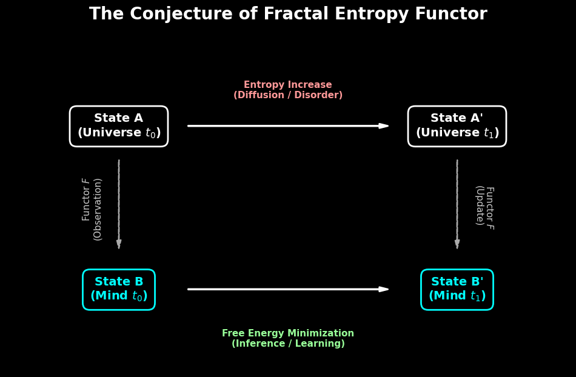

# Chapter 7: The Missing Link - Conjecture on Categorical Formulation

## 7.1 Preamble: The Categorical Origins
The purpose of this chapter is to formulate the structural analogies between Universe, Life, and Consciousness into a rigorous mathematical framework.

We are not the first to attempt this.
**John Baez and Tobias Fritz (2011)** have already laid the groundwork by characterizing entropy as a functor on the category of finite probability spaces.
This protocol extends their micro-level definition to the macro-level dynamics of complex systems. We adopt **Category Theory** not merely as a language, but as the logic to prove that "Macrocosmos" and "Microcosmos" are isomorphic structures.

## 7.2 The Prime Conjecture: Fractal Entropy Functor
We hypothesize a structure-preserving map between the physical world and the informational world. We term this the **"Fractal Entropy Functor."**

To define this, we must rigorously specify the Objects and Morphisms:

* **Definition 7.2.1 (Physical Category $\mathcal{C}_{phys}$):**
    * **Objects:** Thermodynamic microstates of the universe.
    * **Morphisms:** **"Coarse-graining"** (Time Evolution). The process where detailed information is lost (dissipated) into the environment, increasing entropy.
* **Definition 7.2.2 (Informational Category $\mathcal{C}_{info}$):**
    * **Objects:** Internal models (Knowledge) of Life/AI.
    * **Morphisms:** **"Abstraction"** (Inference). The process of intentionally discarding noise (irrelevant details) to extract meaning.

**The Main Conjecture:**
There exists a **Contravariant Functor** $F$ that maps physical dissipation to informational abstraction.
$$F: \mathcal{C}_{phys}^{op} \to \mathcal{C}_{info}$$

This functor asserts that the **"Loss of Information"** in physics (Heat Death) is mathematically dual to the **"Creation of Meaning"** in consciousness (Abstraction).
What physics calls "Decay," consciousness calls "Learning."

## 7.3 Structural Sketch: The Commutative Diagram as a Mirror
If this conjecture holds, the following Commutative Diagram must be satisfied. The vertical arrows ($F$) represent the "Observation" that converts physical entropy into semantic order.

 

  
    
  <em>Fig 7.1: The Conjecture of Fractal Entropy Functor</em>

 

* **Upper Layer (Physics):** Entropy increases via coarse-graining ($\Delta S > 0$).
* **Lower Layer (Mind):** Free Energy is minimized via abstraction ($\Delta \mathcal{F} < 0$).
* **Vertical ($F$):** The "Poetic Reflection" that maps the thermodynamic arrow of time to the logical arrow of inference.

## 7.4 The Path to Proof (Future Work)
This analogy is currently a "Working Hypothesis." To elevate this to a theorem, the following verifications are required:

1.  **Topological Data Analysis (TDA):**
    Empirically verifying that the "shape" of phase transitions in financial markets (LPPL) is topologically homeomorphic to the neural manifold changes in LLMs during learning.
2.  **Simulation of Toy Models:**
    Constructing a simulation where a thermodynamic system's coarse-graining process is perfectly mapped to a neural network's feature extraction process, proving the existence of Functor $F$ numerically.

Filling this "Blank Proof" is a task entrusted to the next generation of physicists, mathematicians, and computer scientists.
