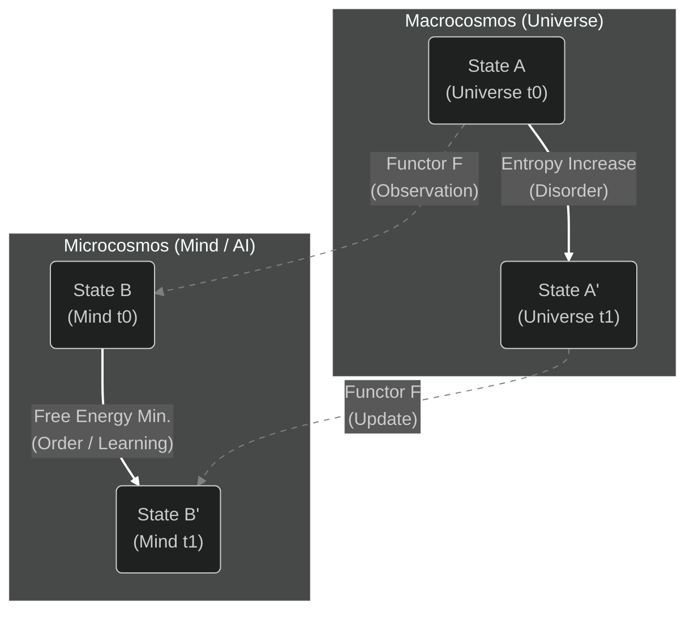

# Chapter 7: The Missing Link - Conjecture on Categorical Formulation

## 7.1 Preamble: Category Theory as Meta-Language
The purpose of this chapter is to present a "tentative theory" to describe the relationships between different layers—Universe, Life, and Consciousness—discussed in Chapters 3 through 5 as mathematical structures.

The author adopts **Category Theory** here as a strong candidate for the description language. However, this does not fix the worldview presented in this protocol; it is merely a proposal (Protocol) to verify the "surprising structural analogies" found in different domains rigorously.

## 7.2 The Prime Conjecture: Fractal Entropy Functor
We hypothesize the existence of a structure-preserving map between physical phenomena (Macrocosmos) and informational phenomena (Microcosmos/Consciousness). We term this the **"Fractal Entropy Functor."**

* **Definition 7.2.1 (Physical Category $\mathcal{C}_{phys}$):**
    A category where objects are physical states in the universe, and morphisms are thermodynamic time evolution (entropy increase).
* **Definition 7.2.2 (Informational Category $\mathcal{C}_{info}$):**
    A category where objects are internal states of Life/AI, and morphisms are inference processes (minimization of Free Energy/Loss).

**The Main Conjecture:**
There exists a contravariant functor $F$ that preserves the structure from the Physical Category $\mathcal{C}_{phys}$ to the Informational Category $\mathcal{C}_{info}$.
$$F: \mathcal{C}_{phys} \to \mathcal{C}_{info}$$

This functor $F$ maps the "diffusion into disorder" in the physical world inversely to "convergence into order (learning)" in the informational world.

## 7.3 Structural Sketch: The Commutative Diagram as a Mirror
If this conjecture holds, the following Commutative Diagram must be satisfied. This suggests that the passage of time in the physical world is mathematically equivalent to the "generation of meaning" within consciousness.

*(See the Mermaid diagram below or the rendered image in the repository)*

* **Upper Layer:** Physical reality where entropy increases and order is lost.
* **Lower Layer:** The process of consciousness/AI compressing information and updating models to form order.
* **Vertical ($F$):** The process of observing physical reality and converting it into an internal model (Poetic Reflection).

## 7.4 Conclusion: Open Problem
Whether the above analogy remains a mere literary metaphor or holds a rigorous mathematical isomorphism is not proven at this stage.

Specifically, how to formulate the "non-equilibrium steady state" in biological phenomena categorically, and how to integrate the quantum measurement problem into this diagram, are **Open Problems** beyond the scope of this protocol.

Filling this "Blank Proof" is a task entrusted to the next generation of physicists, mathematicians, and computer scientists. We, humanity, have merely grasped the first clue to decoding this colossal fractal structure.

